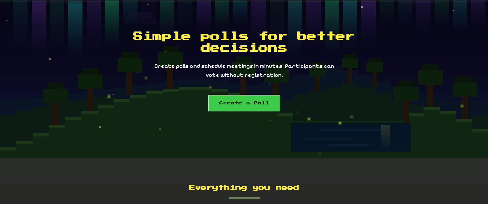
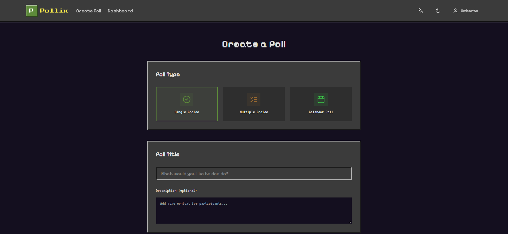
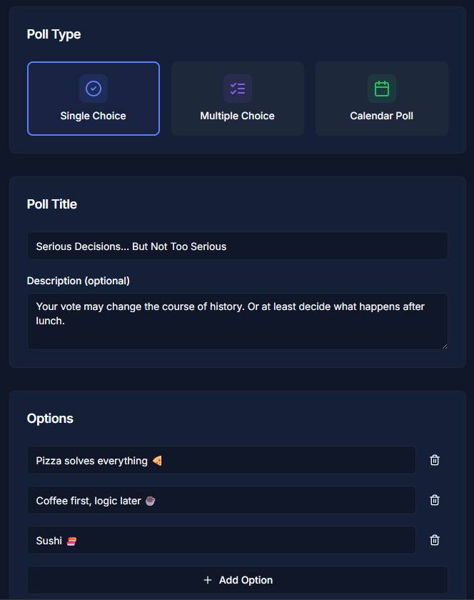

# 🗳️ Pollix

**Pollix** is a collaborative web platform for creating and managing polls, votes, and event scheduling. It simplifies organising meetings, team decisions, and availability collection.

[](https://vercel.com/new/clone?repository-url=https://github.com/umbertocicero/pollix)
[](https://codespaces.new/umbertocicero/pollix)

---

## 📋 Table of Contents

- [Features](#-features)
- [Live](#-live)
- [Tech Stack](#️-tech-stack)
- [Prerequisites](#-prerequisites)
- [Installation](#-installation)
- [Configuration](#️-configuration)
- [Development](#-development)
- [Animations](#-animations)
- [Project Structure](#-project-structure)
- [Deploy](#-deploy)
- [API Reference](#-api-reference)
- [Contributing](#-contributing)
- [Roadmap](#️-roadmap)
- [License](#-license)

---

## ✨ Features

### Poll Types

| Type | Description |
|------|-------------|
| **Single Choice** | Participants select one option |
| **Multiple Choice** | Select multiple options with configurable limits |
| **Calendar** | Collect availability with dates and time slots |

### Highlights

- 🔗 **Shareable links** — share via link, QR code, email, WhatsApp
- 👤 **Guest voting** — participate without registration
- 📊 **Real-time results** — instant updates via Supabase Realtime
- 💬 **Vote comments** — optional per-vote comment, toggled by the creator
- 🚫 **"Not available" option** — calendar polls support an explicit unavailability response
- ⚙️ **Account page** — update display name (propagated to votes) and delete account
- 🎨 **Pixel-art Minecraft theme** — animated day/night background with parallax, aurora, fireflies, and a walking chicken
- 🌍 **Multilingual** — Italian and English with automatic browser detection
- 🌙 **Dark mode** — auto light/dark theme
- 📱 **Mobile-first** — optimised responsive design

### User Dashboard

- Manage active, closed, and draft polls
- Participation statistics
- Poll duplication and archiving

---

## 🎬 Live

> 🌍 Available at: [www.pollix.it](https://www.pollix.it/)

### Screenshots

| Home | Create Poll | Vote |
|------|-------------|------|
|  |  |  |

---

## 🛠️ Tech Stack

### Frontend

| Technology | Version | Description |
|------------|---------|-------------|
| [Next.js](https://nextjs.org/) | 14.x | React framework with App Router |
| [React](https://react.dev/) | 18.x | UI library |
| [TailwindCSS](https://tailwindcss.com/) | 3.x | Utility-first CSS |
| [shadcn/ui](https://ui.shadcn.com/) | latest | Accessible UI components |
| [next-intl](https://next-intl-docs.vercel.app/) | 3.x | Internationalisation |
| [React Hook Form](https://react-hook-form.com/) | 7.x | Form management |
| [Zod](https://zod.dev/) | 3.x | Schema validation |

### Backend

| Technology | Version | Description |
|------------|---------|-------------|
| [NestJS](https://nestjs.com/) | 10.x | Node.js framework |
| [Supabase](https://supabase.com/) | 2.x | Database + Auth + Realtime |
| [PostgreSQL](https://www.postgresql.org/) | 15.x | Relational database |

### Infrastructure

| Service | Plan | Cost |
|---------|------|------|
| [Vercel](https://vercel.com/) | Hobby | Free |
| [Supabase](https://supabase.com/) | Free | Free (500 MB) |
| [GitHub Codespaces](https://github.com/features/codespaces) | Free | 60 h/month |
| [Resend](https://resend.com/) | Free | 3,000 emails/month |

**💰 Total MVP cost: €0/month**

---

## 📋 Prerequisites

### Option A: GitHub Codespaces (Recommended) ⭐

No local installation required!
- GitHub account
- Modern browser

### Option B: Local Development

- Node.js 18+
- pnpm 8+
- Git

---

## 🚀 Installation

### Method 1: GitHub Codespaces

1. **Fork or create the repository**

2. **Open in Codespaces**
   - Go to your repository on GitHub
   - Click **Code** → **Codespaces** → **Create codespace on main**
   - Wait 2–3 minutes for automatic setup

3. **Configure environment variables**
   ```bash
   cp .env.example apps/web/.env.local
   # Edit apps/web/.env.local with your Supabase credentials
   ```

4. **Start the application**
   ```bash
   pnpm dev
   ```

### Method 2: Local Installation

```bash
# Clone the repository
git clone https://github.com/umbertocicero/pollix.git
cd pollix

# Install pnpm (if not present)
npm install -g pnpm

# Install dependencies
pnpm install

# Create environment variables (IMPORTANT: inside apps/web/)
cp .env.example apps/web/.env.local

# Edit apps/web/.env.local with your Supabase credentials

# Start in development mode
pnpm dev
```

---

## ⚙️ Configuration

### 1. Set up Supabase

1. Create a free account at [supabase.com](https://supabase.com)
2. Create a new project
3. Copy credentials from **Project Settings → API**:
   - `Project URL` → `NEXT_PUBLIC_SUPABASE_URL`
   - `anon public` → `NEXT_PUBLIC_SUPABASE_ANON_KEY`
   - `service_role` → `SUPABASE_SERVICE_ROLE_KEY`
4. Run the migration in the SQL Editor: paste the contents of `supabase/migrations/001_initial_schema.sql` and execute

### 2. Set up Authentication

In the Supabase dashboard → **Authentication → Providers**:

- **Email/Password**: enabled by default
- **Google OAuth**: create a project in [Google Cloud Console](https://console.cloud.google.com/), generate an OAuth 2.0 Client, set the redirect to `https://YOUR_PROJECT.supabase.co/auth/v1/callback`, and paste Client ID and Secret into Supabase

### 3. Set up Resend (Email)

1. Create an account at [resend.com](https://resend.com)
2. Generate an API key and add it to `apps/web/.env.local`:
   ```env
   RESEND_API_KEY=re_xxxxxxxxxxxxx
   ```
3. **(Optional) Verify your domain** on Resend → Domains → Add Domain → `pollix.it`, then add the SPF/DKIM DNS records. Required to send from `noreply@pollix.it` instead of Resend's shared domain.

#### Configure Supabase to send emails via Resend SMTP

In the Supabase Dashboard → **Authentication → Configuration → SMTP**:

| Field | Value |
|-------|-------|
| **Host** | `smtp.resend.com` |
| **Port** | `465` |
| **Username** | `resend` |
| **Password** | your `RESEND_API_KEY` (starts with `re_…`) |
| **Sender name** | `Pollix` |
| **Sender email** | `noreply@pollix.it` (or your verified domain) |

#### Customise email templates

Ready-made HTML templates are in `supabase/templates/`. Paste them into the Supabase Dashboard → **Authentication → Email Templates**:

| Template | File | Subject |
|----------|------|---------|
| Confirm signup | `supabase/templates/confirm-signup.html` | `Conferma la tua email – Pollix` |
| Reset password | `supabase/templates/reset-password.html` | `Reimposta la tua password – Pollix` |

The templates use `{{ .ConfirmationURL }}` and `{{ .SiteURL }}` as Supabase variables and are styled to match the Pollix Minecraft aesthetic.

### 4. Environment variables reference

> ⚠️ **Important**: `.env.local` must be created at **`apps/web/.env.local`**, NOT at the repo root.

| Variable | Required | Purpose |
|----------|----------|---------|
| `NEXT_PUBLIC_SUPABASE_URL` | Yes | Supabase project URL |
| `NEXT_PUBLIC_SUPABASE_ANON_KEY` | Yes | Supabase anon key |
| `SUPABASE_SERVICE_ROLE_KEY` | Yes | Server-side admin operations |
| `NEXT_PUBLIC_APP_URL` | Yes | Canonical URL (sitemap / metadata) |
| `RESEND_API_KEY` | Optional | Transactional email |
| `NEXT_PUBLIC_GTM_ID` | Optional | Google Tag Manager |
| `NEXT_PUBLIC_COOKIEYES_ID` | Optional | Cookie consent banner |
| `NEXT_PUBLIC_GOOGLE_ANALYTICS_ID` | Optional | GA direct (only if GTM is not set) |
| `NEXT_PUBLIC_GOOGLE_SITE_VERIFICATION` | Optional | Google Search Console meta tag |

---

## 💻 Development

### Commands

```bash
pnpm dev                          # start all apps in watch mode
pnpm --filter @planora/web dev    # frontend only (port 3000)
pnpm --filter @planora/api dev    # backend only (port 3001)
pnpm build                        # production build
pnpm lint                         # TypeScript type-check (tsc --noEmit)
pnpm test                         # jest --passWithNoTests
pnpm format                       # prettier on ts/tsx/md/json
pnpm db:generate                  # regenerate Supabase types
pnpm db:migrate                   # push migrations to Supabase
```

### Dev Ports

| Service | URL |
|---------|-----|
| Next.js frontend | http://localhost:3000 |
| NestJS backend | http://localhost:3001 |
| Supabase Studio | http://localhost:54322 |

---

## 🎨 Animations

The Minecraft pixel-art theme uses two distinct animation systems.

### Background scene — `components/mc-background.tsx`

A layered SVG landscape rendered once and animated entirely with **SVG SMIL** (`<animate>` / `<animateTransform>`). There is zero JavaScript per frame; all motion is declarative.

The scene is built as depth layers from back to front:

| Layer | Day | Night |
|-------|-----|-------|
| Sky gradient | Blue (#3D8FD6 → #B3DDF5) | Deep space (#05040F → #19305A) |
| Aurora | — | 28 shimmering vertical bars (green / teal / violet gradients) that wave horizontally |
| Stars | — | 28 static pixels; every third one twinkles with an opacity `<animate>` |
| Shooting stars | — | 3 streaks that diagonal-flash and translate, hidden on mobile |
| Moon / Sun | Pixelated sun with pulsing rays | Pixelated moon with craters |
| Clouds | White, drift left at 70 s/loop | Dark, drift left at 90 s/loop |
| Birds | 3 silhouettes cross left-to-right with wing-flap | — |
| Far hills | Hazy silhouette | Dark blue |
| Mid hills | Green | Near-black |
| Near hills | Rolling XP-Bliss grass, each step highlighted | Same, darker |
| Lake | Shimmer bands drift in alternating directions; sun/moon reflection pulses | Same with blue palette |
| Trees | 9 foreground trees sway with staggered `rotate` timing | Same, darker trunks |
| Flowers | Coloured 3×3 pixels scattered on the slope | — |
| Fireflies | — | 8 particles that glow (opacity pulse) and drift in slow arcs |
| Floating motes | White pollen rising (hidden on mobile) | Amber embers rising (hidden on mobile) |
| Background chicken | Follows the hill surface via a 10-keyframe `translate` path, flips at the midpoint, body bobs at 0.5 s | Same |

The theme (day vs. night) is read from `next-themes` `resolvedTheme` and all colours are recalculated on mount.

### Walking chicken widget — `components/walking-chicken.tsx`

An interactive chicken placed at the top edge of card components (`absolute bottom-full`). It uses a combination of **CSS animations** and **SVG SMIL**:

| Motion | Technique | Detail |
|--------|-----------|--------|
| Horizontal walk | CSS `transform: translateX` on `.mc-chicken-pos` | Full-width wrapper translates from `4 px` to `calc(100% − 34 px)` and back. Using `transform` (GPU-composited) rather than `left` ensures it works on iOS Safari. |
| Direction flip | CSS `scaleX(-1)` on `.mc-chicken-flip` | Switches at the 50% keyframe via `steps(1)` — the chicken faces left on the return leg. |
| Leg steps | SVG SMIL `animateTransform type="rotate"` | Two legs rotate in opposite phase at 0.8 s each. SMIL is used so legs can be paused independently via `svg.pauseAnimations()`. |
| Idle head bob | CSS `@keyframes mc-breathe` on `.mc-chicken-head` | Gentle 3.5 s translate + rotate loop, giving life while the chicken stands still. |
| Hover pause | `onPointerEnter` / `onPointerLeave` (mouse only) | Sets `hovered = true` → adds `is-paused` class (CSS `animation-play-state: paused`) and calls `svg.pauseAnimations()`. Filtered to `pointerType === 'mouse'` so mobile touch taps never accidentally freeze the walk. |
| Tap reaction | `onClick` → `poke()` | Sets `startled = true` for ~1 s, triggering CSS keyframes: body hop (`mc-hop`), neck stretch (`mc-neck`), wing flap (`mc-wing-f` / `mc-wing-b`), and five flying feather pixels (`mc-fly-a`…`mc-fly-e`). |
| Reduced motion | `@media (prefers-reduced-motion: reduce)` | Disables all CSS animations (walk, flip, head bob). SMIL leg steps continue because SMIL is not a CSS animation. |

---

## 📁 Project Structure

```
pollix/
├── .devcontainer/             # GitHub Codespaces config
├── .github/workflows/ci.yml   # GitHub Actions CI
├── apps/
│   ├── web/                   # Next.js 14 frontend (@planora/web)
│   │   ├── app/               # App Router pages
│   │   ├── components/        # UI components
│   │   │   ├── layout/        # Header, Footer, navigation
│   │   │   ├── providers/     # Theme provider
│   │   │   └── ui/            # shadcn/ui primitives
│   │   ├── lib/
│   │   │   ├── i18n/          # next-intl config
│   │   │   └── supabase/      # browser + server clients
│   │   └── messages/          # en.json / it.json translations
│   └── api/                   # NestJS backend (@planora/api, optional)
│       └── src/
│           ├── polls/         # Polls module
│           ├── votes/         # Votes module
│           └── supabase/      # Supabase service
├── packages/
│   └── shared/                # Shared types + Zod schemas (@planora/shared)
│       └── src/
│           ├── types/         # TypeScript interfaces (camelCase)
│           └── schemas/       # Zod validation schemas
└── supabase/
    ├── migrations/            # SQL migrations (run in order)
    └── templates/             # Custom HTML email templates (paste into Supabase Dashboard)
```

---

## 🚢 Deploy

### Frontend on Vercel

1. Import the repository at [vercel.com](https://vercel.com)
2. Configure the build:
   ```
   Framework Preset : Next.js
   Root Directory   : apps/web
   Build Command    : pnpm build
   Install Command  : pnpm install
   ```
3. Add all environment variables from `.env.local`
4. Every push to `main` triggers an automatic deploy

### Backend (Optional)

The NestJS API is optional — the web app talks directly to Supabase.

**Railway.app:**
```bash
npm i -g @railway/cli
railway login && railway init && railway up
```

**Render.com:** connect the repository, set root to `apps/api`, build command `pnpm build`, start command `node dist/main`.

---

## 📚 API Reference

The web app calls Supabase directly for most operations. The NestJS API mirrors the same endpoints for server-to-server use.

All authenticated requests require:
```http
Authorization: Bearer <supabase_jwt_token>
```

### Polls

```http
POST /api/polls
```
```json
{
  "title": "Which logo do you prefer?",
  "pollType": "single_choice",
  "options": [{ "text": "Logo A" }, { "text": "Logo B" }],
  "allowAnonymous": true,
  "requireName": true
}
```

```http
GET /api/polls/:shortId
```
Returns poll details with options and votes.

### Votes

```http
POST /api/votes
```
```json
{
  "pollId": "uuid",
  "optionIds": ["uuid1"],
  "voterName": "Jane Smith"
}
```

---

## 🤝 Contributing

Contributions are welcome!

1. Fork the repository
2. Create a feature branch: `git checkout -b feature/my-feature`
3. Commit your changes: `git commit -m 'Add my feature'`
4. Push the branch: `git push origin feature/my-feature`
5. Open a Pull Request

---

## 🗺️ Roadmap

### MVP (Done) ✅
- [x] Single / multiple choice polls
- [x] Calendar polls with advanced date picker
- [x] Shareable links + QR code
- [x] Guest voting with anonymous tracking
- [x] Edit / delete votes (logged-in and anonymous)
- [x] Dashboard: My Polls / Voted Polls tabs
- [x] Real-time results via Supabase Realtime
- [x] IT / EN multilingual with automatic browser detection
- [x] Dark mode
- [x] SEO + Google Analytics

### v1.1 (Released) 🎮
- [x] Pixel / Minecraft UI + click animations
- [x] Animated Minecraft background (day/night, parallax, aurora, fireflies, walking chicken)
- [x] Account page: edit display name + delete account with data removal
- [x] "Not available" flag for calendar polls
- [x] Per-vote comments flag

### v1.2 (Planned) 📋
- [ ] Google Calendar integration
- [ ] Webhook notifications
- [ ] Advanced statistics
- [ ] Winner notification
- [ ] CSV / PDF export
- [ ] Password-protected polls
- [ ] Automatic poll expiry
- [ ] Mobile UX improvements
- [ ] Internazionalizzare Mail di registrazione

### v2.0 (Future) 🔮
- [ ] AI: suggest best time slots using LLM
- [ ] Ranked-choice polls
- [ ] Enterprise SSO
- [ ] Mobile app (React Native)

---

## 📄 License

Distributed under the **MIT** licence. See `LICENSE` for details.

---

## 👤 Author

- GitHub: [@umbertocicero](https://github.com/umbertocicero)
- LinkedIn: [Umberto Antonio Cicero](https://www.linkedin.com/in/umberto-antonio-cicero/)

---

## 🙏 Acknowledgements

- [shadcn/ui](https://ui.shadcn.com/) — UI components
- [Supabase](https://supabase.com/) — Backend as a Service
- [Vercel](https://vercel.com/) — Hosting
- [Lucide Icons](https://lucide.dev/) — Icons

---

<div align="center">

⭐ **If you like the project, leave a star!** ⭐

</div>
